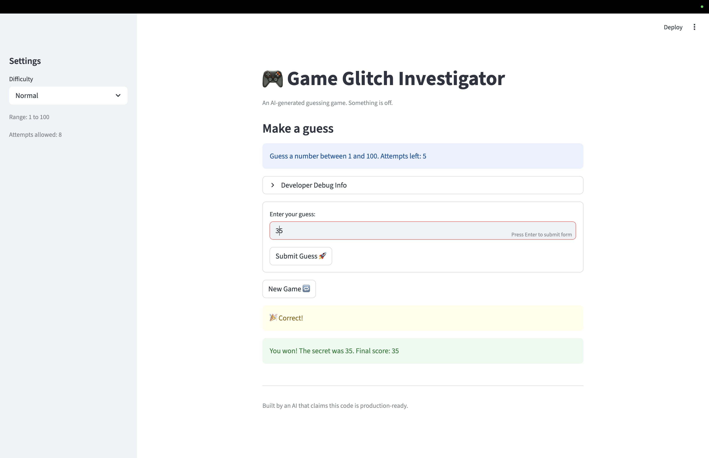

# 🎮 Game Glitch Investigator: The Impossible Guesser

## 🚨 The Situation

You asked an AI to build a simple "Number Guessing Game" using Streamlit.
It wrote the code, ran away, and now the game is unplayable. 

- You can't win.
- The hints lie to you.
- The secret number seems to have commitment issues.

## 🛠️ Setup

1. Install dependencies: `pip install -r requirements.txt`
2. Run the broken app: `python -m streamlit run app.py`

## 🕵️‍♂️ Your Mission

1. **Play the game.** Open the "Developer Debug Info" tab in the app to see the secret number. Try to win.
2. **Find the State Bug.** Why does the secret number change every time you click "Submit"? Ask ChatGPT: *"How do I keep a variable from resetting in Streamlit when I click a button?"*
3. **Fix the Logic.** The hints ("Higher/Lower") are wrong. Fix them.
4. **Refactor & Test.** - Move the logic into `logic_utils.py`.
   - Run `pytest` in your terminal.
   - Keep fixing until all tests pass!

## 📝 Document Your Experience

- [ ] Describe the game's purpose.
  - The purpose of the game is to have a user guess a number within fixed ranges based on the difficulty setting. The player gets hints to help them narrow down the correct numbers.
- [x] Detail which bugs you found.
  1. **Swapped hint messages** — Guessing too high displayed "Go HIGHER!" and guessing too low displayed "Go LOWER!", the opposite of what they should say.
  2. **Wrong hints on every even attempt** — The secret number was cast to a string on even-numbered attempts, causing alphabetical comparison (e.g. `"9" > "50"` is `True`), which produced incorrect hints every other guess.
  3. **Hard difficulty easier than Normal** — Hard mode used the range 1–50, which is a smaller and easier range than Normal's 1–100.
  4. **Score increases on wrong guesses** — Guessing too high on even-numbered attempts awarded +5 points instead of deducting them, rewarding wrong answers.
  5. **New game button broken after win or loss** — Clicking "New Game" did not reset the game status, so the game immediately ended again and prevented the player from playing another round.
  6. **Info banner showed wrong range** — The hint banner always displayed "Guess a number between 1 and 100" regardless of difficulty, even when the actual range was different (e.g. 1–20 on Easy).
  7. **Attempts counter started at 1** — The attempts counter was initialized to 1 instead of 0, causing the "attempts left" display to be off by one and scoring to count the first guess as attempt 2.
  8. **New game used hardcoded range** — The "New Game" button always generated a secret number between 1 and 100, ignoring the selected difficulty's range.
- [x] Explain what fixes you applied.
  1. Swapped the hint messages in `check_guess` so "Too High" shows "Go LOWER!" and "Too Low" shows "Go HIGHER!".
  2. Removed the even-attempt string cast so the secret is always compared as an integer.
  3. Changed the Hard difficulty range from 1–50 to 1–200.
  4. Removed the `+5` branch for "Too High" guesses so both wrong outcomes consistently deduct 5 points.
  5. Updated the "New Game" handler to also reset `status`, `score`, and `history`.
  6. Updated the info banner to use the `low` and `high` variables from `get_range_for_difficulty`.
  7. Changed the attempts initialization from `1` to `0`.
  8. Updated the "New Game" handler to use `random.randint(low, high)` instead of `random.randint(1, 100)`.

## 📸 Demo

